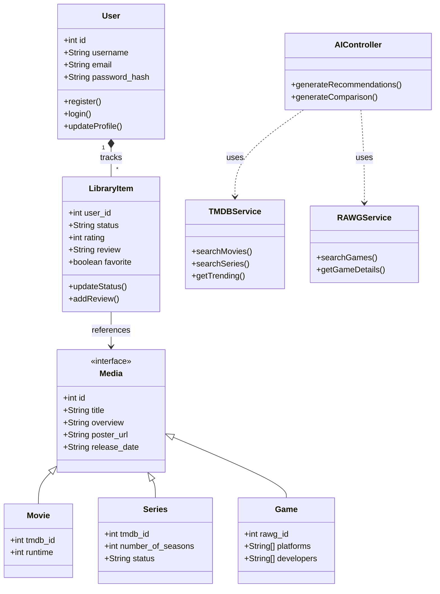

# Conceptual Class Diagram

```mermaid
classDiagram
    class User {
        +int id
        +String username
        +String email
        +String password_hash
        +register()
        +login()
        +updateProfile()
    }

    class Media {
        <<interface>>
        +int id
        +String title
        +String overview
        +String poster_url
        +String release_date
    }

    class Movie {
        +int tmdb_id
        +int runtime
    }

    class Series {
        +int tmdb_id
        +int number_of_seasons
        +String status
    }

    class Game {
        +int rawg_id
        +String[] platforms
        +String[] developers
    }

    class LibraryItem {
        +int user_id
        +String status
        +int rating
        +String review
        +boolean favorite
        +updateStatus()
        +addReview()
    }

    class AIController {
        +generateRecommendations()
        +generateComparison()
    }

    class TMDBService {
        +searchMovies()
        +searchSeries()
        +getTrending()
    }

    class RAWGService {
        +searchGames()
        +getGameDetails()
    }

    Media <|-- Movie
    Media <|-- Series
    Media <|-- Game
    
    User "1" *-- "*" LibraryItem : tracks
    LibraryItem --> Media : references
    
    AIController ..> TMDBService : uses
    AIController ..> RAWGService : uses
```
