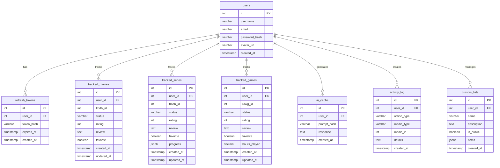

# Entity Relationship Diagram (ERD)

```mermaid
erDiagram
    users {
        int id PK
        varchar username
        varchar email
        varchar password_hash
        varchar avatar_url
        timestamp created_at
    }

    refresh_tokens {
        int id PK
        int user_id FK
        varchar token_hash
        timestamp expires_at
        timestamp created_at
    }

    tracked_movies {
        int id PK
        int user_id FK
        int tmdb_id
        varchar status
        int rating
        text review
        boolean favorite
        timestamp created_at
        timestamp updated_at
    }

    tracked_series {
        int id PK
        int user_id FK
        int tmdb_id
        varchar status
        int rating
        text review
        boolean favorite
        jsonb progress
        timestamp created_at
        timestamp updated_at
    }

    tracked_games {
        int id PK
        int user_id FK
        int rawg_id
        varchar status
        int rating
        text review
        boolean favorite
        decimal hours_played
        timestamp created_at
        timestamp updated_at
    }

    ai_cache {
        int id PK
        int user_id FK
        varchar prompt_hash
        text response
        timestamp created_at
    }

    activity_log {
        int id PK
        int user_id FK
        varchar action_type
        varchar media_type
        int media_id
        text details
        timestamp created_at
    }

    custom_lists {
        int id PK
        int user_id FK
        varchar name
        text description
        boolean is_public
        jsonb items
        timestamp created_at
    }

    users ||--o{ refresh_tokens : "has"
    users ||--o{ tracked_movies : "tracks"
    users ||--o{ tracked_series : "tracks"
    users ||--o{ tracked_games : "tracks"
    users ||--o{ ai_cache : "generates"
    users ||--o{ activity_log : "creates"
    users ||--o{ custom_lists : "manages"
```
