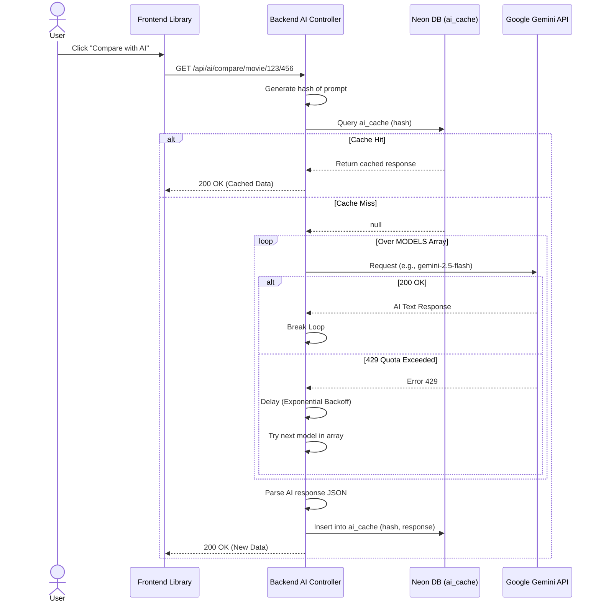

# AI Integration Sequence (Gemini with Fallback)

```mermaid
sequenceDiagram
    actor User
    participant React as Frontend Library
    participant Express as Backend AI Controller
    participant DB as Neon DB (ai_cache)
    participant Gemini as Google Gemini API

    User->>React: Click "Compare with AI"
    React->>Express: GET /api/ai/compare/movie/123/456
    
    %% Cache Check
    Express->>Express: Generate hash of prompt
    Express->>DB: Query ai_cache (hash)
    alt Cache Hit
        DB-->>Express: Return cached response
        Express-->>React: 200 OK (Cached Data)
    else Cache Miss
        DB-->>Express: null
        
        %% API Call with Fallback Loop
        loop Over MODELS Array
            Express->>Gemini: Request (e.g., gemini-2.5-flash)
            alt 200 OK
                Gemini-->>Express: AI Text Response
                Express->>Express: Break Loop
            else 429 Quota Exceeded
                Gemini-->>Express: Error 429
                Express->>Express: Delay (Exponential Backoff)
                Express->>Express: Try next model in array
            end
        end
        
        %% Store and Return
        Express->>Express: Parse AI response JSON
        Express->>DB: Insert into ai_cache (hash, response)
        Express-->>React: 200 OK (New Data)
    end
```
