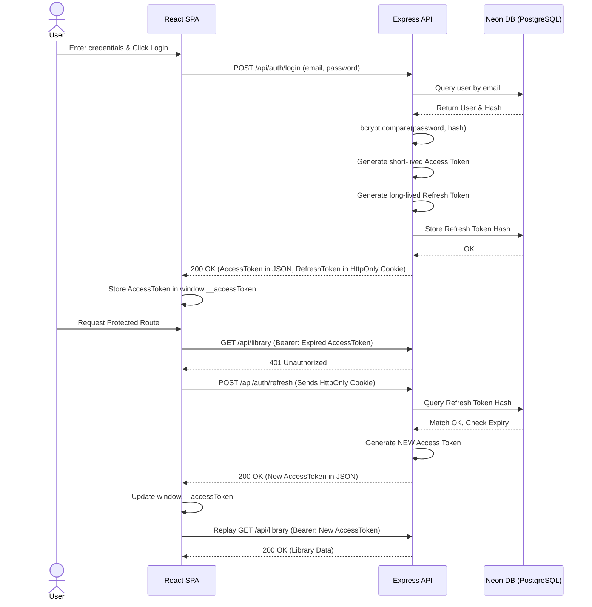

# Authentication Sequence (Login & JWT Refresh)

```mermaid
sequenceDiagram
    actor User
    participant Frontend as React SPA
    participant Backend as Express API
    participant DB as Neon DB (PostgreSQL)

    %% Initial Login
    User->>Frontend: Enter credentials & Click Login
    Frontend->>Backend: POST /api/auth/login (email, password)
    Backend->>DB: Query user by email
    DB-->>Backend: Return User & Hash
    Backend->>Backend: bcrypt.compare(password, hash)
    Backend->>Backend: Generate short-lived Access Token
    Backend->>Backend: Generate long-lived Refresh Token
    Backend->>DB: Store Refresh Token Hash
    DB-->>Backend: OK
    Backend-->>Frontend: 200 OK (AccessToken in JSON, RefreshToken in HttpOnly Cookie)
    Frontend->>Frontend: Store AccessToken in window.__accessToken

    %% API Request with Expired Token
    User->>Frontend: Request Protected Route
    Frontend->>Backend: GET /api/library (Bearer: Expired AccessToken)
    Backend-->>Frontend: 401 Unauthorized

    %% Silent Refresh Interceptor
    Frontend->>Backend: POST /api/auth/refresh (Sends HttpOnly Cookie)
    Backend->>DB: Query Refresh Token Hash
    DB-->>Backend: Match OK, Check Expiry
    Backend->>Backend: Generate NEW Access Token
    Backend-->>Frontend: 200 OK (New AccessToken in JSON)
    Frontend->>Frontend: Update window.__accessToken
    Frontend->>Backend: Replay GET /api/library (Bearer: New AccessToken)
    Backend-->>Frontend: 200 OK (Library Data)
```
