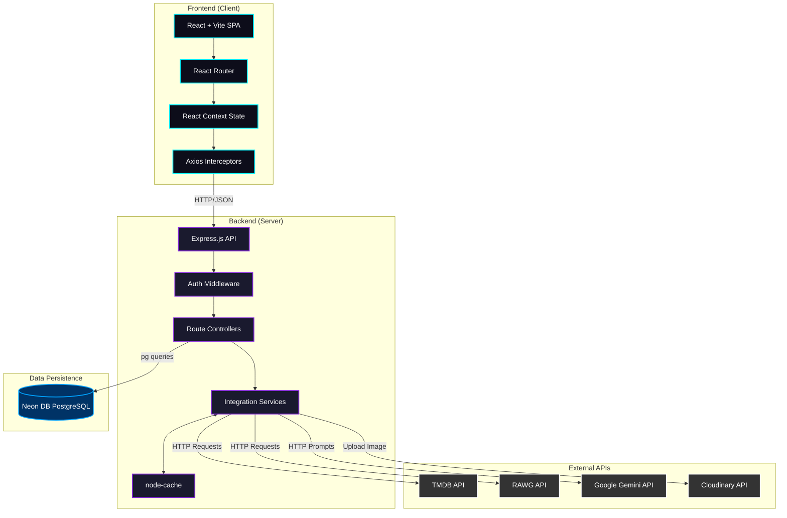

# System Architecture

```mermaid
graph TD
    %% Define styles
    classDef client fill:#0d0d1a,stroke:#00f3ff,stroke-width:2px,color:#fff
    classDef server fill:#1a1a2e,stroke:#8a2be2,stroke-width:2px,color:#fff
    classDef db fill:#003366,stroke:#00a3ff,stroke-width:2px,color:#fff
    classDef external fill:#333333,stroke:#fff,stroke-width:2px,color:#fff

    subgraph "Frontend (Client)"
        UI[React + Vite SPA]
        Router[React Router]
        Axios[Axios Interceptors]
        Context[React Context State]
        UI --> Router
        Router --> Context
        Context --> Axios
    end
    class UI,Router,Axios,Context client

    subgraph "Backend (Server)"
        API[Express.js API]
        AuthMid[Auth Middleware]
        Controllers[Route Controllers]
        Services[Integration Services]
        Cache[node-cache]
        API --> AuthMid
        AuthMid --> Controllers
        Controllers --> Services
        Services <--> Cache
    end
    class API,AuthMid,Controllers,Services,Cache server

    subgraph "Data Persistence"
        NeonDB[(Neon DB PostgreSQL)]
    end
    class NeonDB db

    subgraph "External APIs"
        TMDB[TMDB API]
        RAWG[RAWG API]
        Gemini[Google Gemini API]
        Cloudinary[Cloudinary API]
    end
    class TMDB,RAWG,Gemini,Cloudinary external

    %% Connections
    Axios -- "HTTP/JSON" --> API
    Controllers -- "pg queries" --> NeonDB
    Services -- "HTTP Requests" --> TMDB
    Services -- "HTTP Requests" --> RAWG
    Services -- "HTTP Prompts" --> Gemini
    Services -- "Upload Image" --> Cloudinary
```
