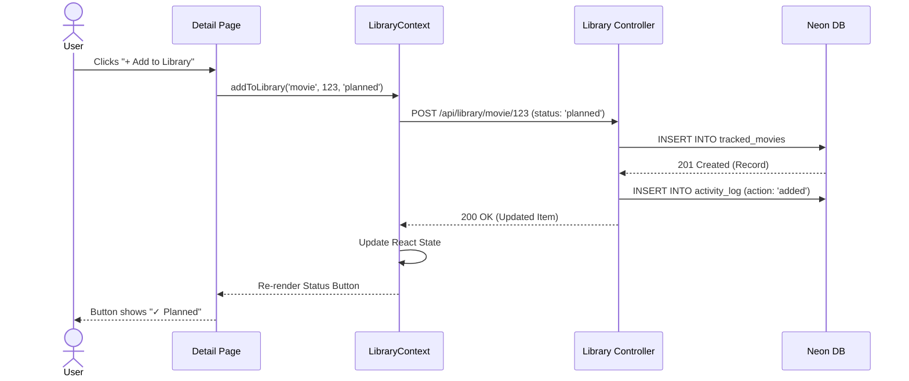

# Use Case: Add to Library

```mermaid
sequenceDiagram
    actor User
    participant UI as Detail Page
    participant Lib as LibraryContext
    participant API as Library Controller
    participant DB as Neon DB

    User->>UI: Clicks "+ Add to Library"
    UI->>Lib: addToLibrary('movie', 123, 'planned')
    Lib->>API: POST /api/library/movie/123 (status: 'planned')
    API->>DB: INSERT INTO tracked_movies
    DB-->>API: 201 Created (Record)
    
    API->>DB: INSERT INTO activity_log (action: 'added')
    
    API-->>Lib: 200 OK (Updated Item)
    Lib->>Lib: Update React State
    Lib-->>UI: Re-render Status Button
    UI-->>User: Button shows "✓ Planned"
```
