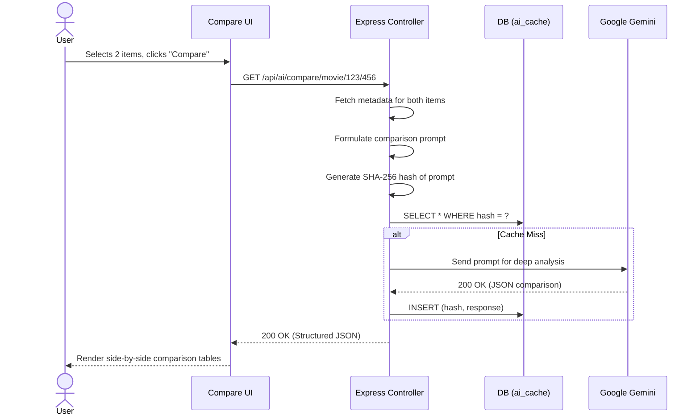

# Use Case: Generate AI Comparison

```mermaid
sequenceDiagram
    actor User
    participant UI as Compare UI
    participant API as Express Controller
    participant Cache as DB (ai_cache)
    participant Gemini as Google Gemini

    User->>UI: Selects 2 items, clicks "Compare"
    UI->>API: GET /api/ai/compare/movie/123/456
    
    API->>API: Fetch metadata for both items
    API->>API: Formulate comparison prompt
    API->>API: Generate SHA-256 hash of prompt
    
    API->>Cache: SELECT * WHERE hash = ?
    alt Cache Miss
        API->>Gemini: Send prompt for deep analysis
        Gemini-->>API: 200 OK (JSON comparison)
        API->>Cache: INSERT (hash, response)
    end
    
    API-->>UI: 200 OK (Structured JSON)
    UI-->>User: Render side-by-side comparison tables
```
