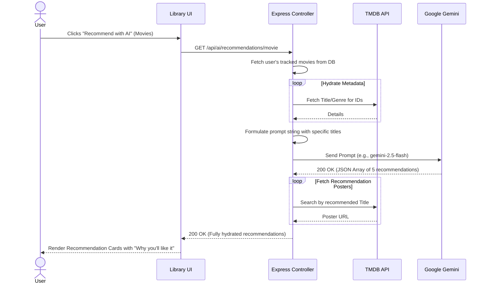

# Use Case: Generate AI Recommendations

```mermaid
sequenceDiagram
    actor User
    participant UI as Library UI
    participant API as Express Controller
    participant TMDB as TMDB API
    participant Gemini as Google Gemini

    User->>UI: Clicks "Recommend with AI" (Movies)
    UI->>API: GET /api/ai/recommendations/movie
    
    API->>API: Fetch user's tracked movies from DB
    
    loop Hydrate Metadata
        API->>TMDB: Fetch Title/Genre for IDs
        TMDB-->>API: Details
    end
    
    API->>API: Formulate prompt string with specific titles
    
    API->>Gemini: Send Prompt (e.g., gemini-2.5-flash)
    Gemini-->>API: 200 OK (JSON Array of 5 recommendations)
    
    loop Fetch Recommendation Posters
        API->>TMDB: Search by recommended Title
        TMDB-->>API: Poster URL
    end
    
    API-->>UI: 200 OK (Fully hydrated recommendations)
    UI-->>User: Render Recommendation Cards with "Why you'll like it"
```
