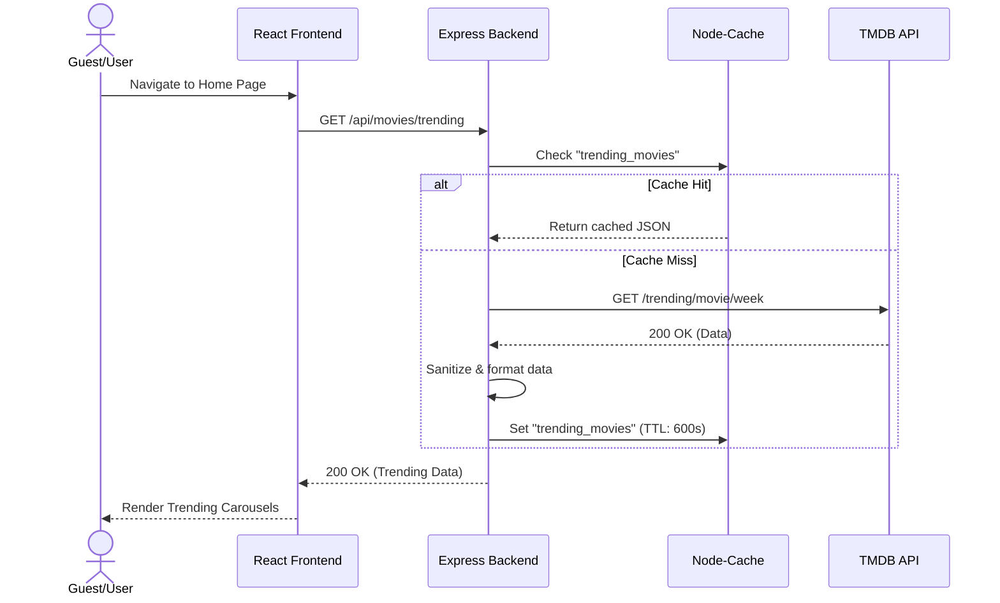

# Use Case: Browse Trending Media

```mermaid
sequenceDiagram
    actor Guest/User
    participant UI as React Frontend
    participant API as Express Backend
    participant Cache as Node-Cache
    participant TMDB as TMDB API

    Guest/User->>UI: Navigate to Home Page
    UI->>API: GET /api/movies/trending
    API->>Cache: Check "trending_movies"
    alt Cache Hit
        Cache-->>API: Return cached JSON
    else Cache Miss
        API->>TMDB: GET /trending/movie/week
        TMDB-->>API: 200 OK (Data)
        API->>API: Sanitize & format data
        API->>Cache: Set "trending_movies" (TTL: 600s)
    end
    API-->>UI: 200 OK (Trending Data)
    UI-->>Guest/User: Render Trending Carousels
```
