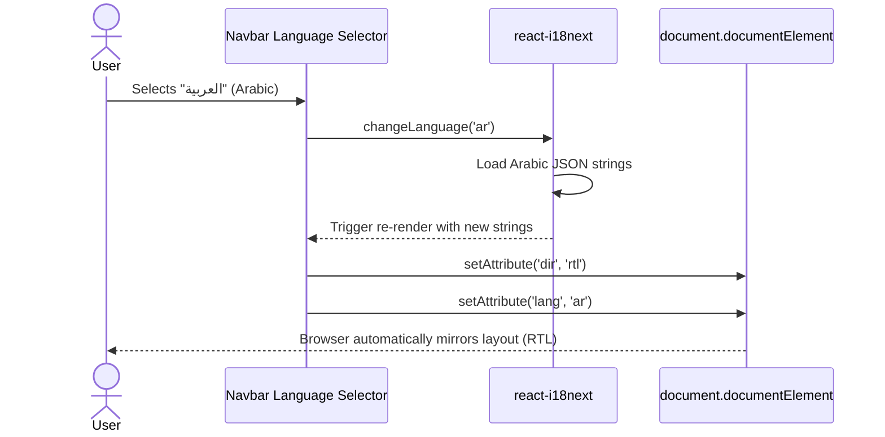

# Use Case: Change Language (EN/AR)

```mermaid
sequenceDiagram
    actor User
    participant UI as Navbar Language Selector
    participant i18n as react-i18next
    participant DOM as document.documentElement

    User->>UI: Selects "العربية" (Arabic)
    UI->>i18n: changeLanguage('ar')
    i18n->>i18n: Load Arabic JSON strings
    i18n-->>UI: Trigger re-render with new strings
    UI->>DOM: setAttribute('dir', 'rtl')
    UI->>DOM: setAttribute('lang', 'ar')
    DOM-->>User: Browser automatically mirrors layout (RTL)
```
