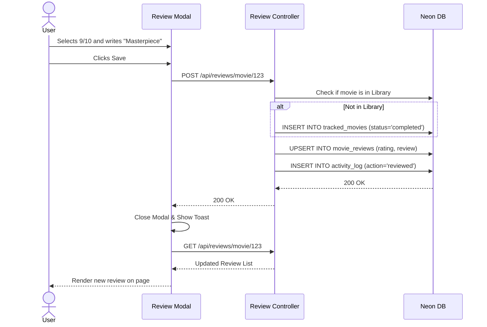

# Use Case: Rate & Review

```mermaid
sequenceDiagram
    actor User
    participant UI as Review Modal
    participant API as Review Controller
    participant DB as Neon DB

    User->>UI: Selects 9/10 and writes "Masterpiece"
    User->>UI: Clicks Save
    UI->>API: POST /api/reviews/movie/123
    
    API->>DB: Check if movie is in Library
    alt Not in Library
        API->>DB: INSERT INTO tracked_movies (status='completed')
    end
    
    API->>DB: UPSERT INTO movie_reviews (rating, review)
    API->>DB: INSERT INTO activity_log (action='reviewed')
    
    DB-->>API: 200 OK
    API-->>UI: 200 OK
    UI->>UI: Close Modal & Show Toast
    UI->>API: GET /api/reviews/movie/123
    API-->>UI: Updated Review List
    UI-->>User: Render new review on page
```
