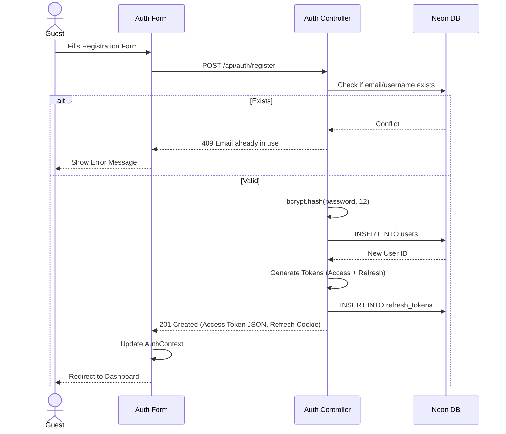

# Use Case: Register / Login

```mermaid
sequenceDiagram
    actor Guest
    participant UI as Auth Form
    participant Auth as Auth Controller
    participant DB as Neon DB

    Guest->>UI: Fills Registration Form
    UI->>Auth: POST /api/auth/register
    Auth->>DB: Check if email/username exists
    alt Exists
        DB-->>Auth: Conflict
        Auth-->>UI: 409 Email already in use
        UI-->>Guest: Show Error Message
    else Valid
        Auth->>Auth: bcrypt.hash(password, 12)
        Auth->>DB: INSERT INTO users
        DB-->>Auth: New User ID
        Auth->>Auth: Generate Tokens (Access + Refresh)
        Auth->>DB: INSERT INTO refresh_tokens
        Auth-->>UI: 201 Created (Access Token JSON, Refresh Cookie)
        UI->>UI: Update AuthContext
        UI-->>Guest: Redirect to Dashboard
    end
```
