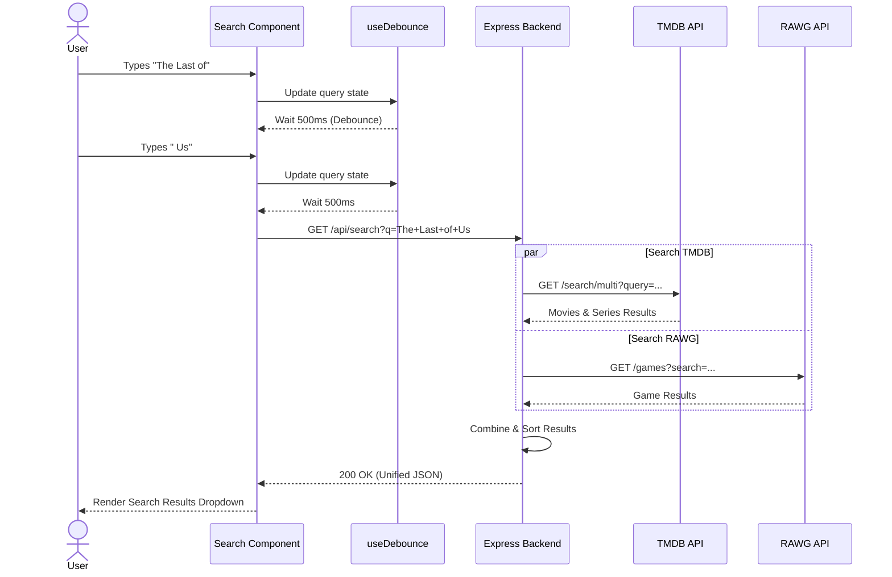

# Use Case: Search Media

```mermaid
sequenceDiagram
    actor User
    participant UI as Search Component
    participant Hook as useDebounce
    participant API as Express Backend
    participant TMDB as TMDB API
    participant RAWG as RAWG API

    User->>UI: Types "The Last of"
    UI->>Hook: Update query state
    Hook-->>UI: Wait 500ms (Debounce)
    User->>UI: Types " Us"
    UI->>Hook: Update query state
    Hook-->>UI: Wait 500ms
    UI->>API: GET /api/search?q=The+Last+of+Us
    
    par Search TMDB
        API->>TMDB: GET /search/multi?query=...
        TMDB-->>API: Movies & Series Results
    and Search RAWG
        API->>RAWG: GET /games?search=...
        RAWG-->>API: Game Results
    end
    
    API->>API: Combine & Sort Results
    API-->>UI: 200 OK (Unified JSON)
    UI-->>User: Render Search Results Dropdown
```
