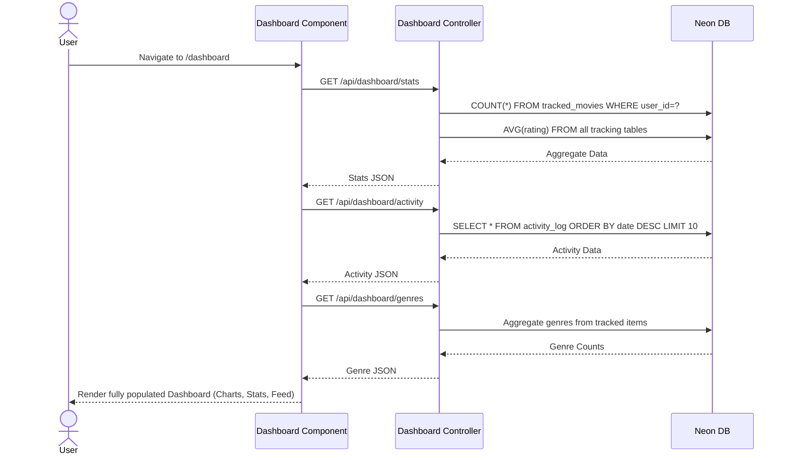

# Use Case: View Dashboard Stats

```mermaid
sequenceDiagram
    actor User
    participant UI as Dashboard Component
    participant API as Dashboard Controller
    participant DB as Neon DB

    User->>UI: Navigate to /dashboard
    UI->>API: GET /api/dashboard/stats
    API->>DB: COUNT(*) FROM tracked_movies WHERE user_id=?
    API->>DB: AVG(rating) FROM all tracking tables
    DB-->>API: Aggregate Data
    API-->>UI: Stats JSON

    UI->>API: GET /api/dashboard/activity
    API->>DB: SELECT * FROM activity_log ORDER BY date DESC LIMIT 10
    DB-->>API: Activity Data
    API-->>UI: Activity JSON

    UI->>API: GET /api/dashboard/genres
    API->>DB: Aggregate genres from tracked items
    DB-->>API: Genre Counts
    API-->>UI: Genre JSON

    UI-->>User: Render fully populated Dashboard (Charts, Stats, Feed)
```
