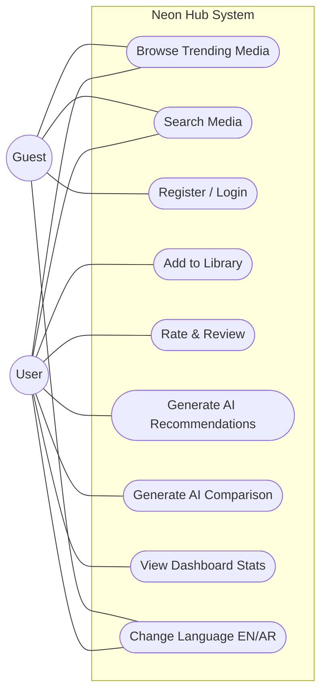

# System Use Cases

```mermaid
flowchart LR
    %% Actors
    Guest((Guest))
    User((User))

    %% System Boundary
    subgraph Neon Hub System
        UC1([Browse Trending Media])
        UC2([Search Media])
        UC3([Register / Login])
        UC4([Add to Library])
        UC5([Rate & Review])
        UC6([Generate AI Recommendations])
        UC7([Generate AI Comparison])
        UC8([View Dashboard Stats])
        UC9([Change Language EN/AR])
    end

    %% Guest Associations
    Guest --- UC1
    Guest --- UC2
    Guest --- UC3
    Guest --- UC9

    %% User Associations
    User --- UC1
    User --- UC2
    User --- UC4
    User --- UC5
    User --- UC6
    User --- UC7
    User --- UC8
    User --- UC9
```
