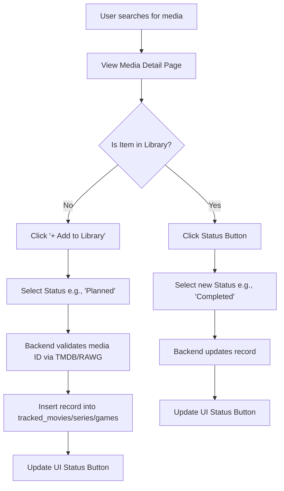

# Add Media Workflow

```mermaid
flowchart TD
    A[User searches for media] --> B[View Media Detail Page]
    B --> C{Is Item in Library?}
    
    C -- No --> D[Click '+ Add to Library']
    D --> E[Select Status e.g., 'Planned']
    E --> F[Backend validates media ID via TMDB/RAWG]
    F --> G[Insert record into tracked_movies/series/games]
    G --> H[Update UI Status Button]
    
    C -- Yes --> I[Click Status Button]
    I --> J[Select new Status e.g., 'Completed']
    J --> K[Backend updates record]
    K --> L[Update UI Status Button]
```
