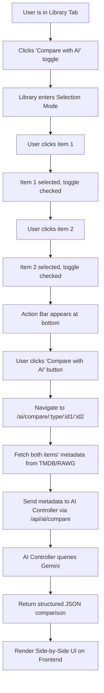

# AI Compare Workflow

```mermaid
flowchart TD
    A[User is in Library Tab] --> B[Clicks 'Compare with AI' toggle]
    B --> C[Library enters Selection Mode]
    C --> D[User clicks item 1]
    D --> E[Item 1 selected, toggle checked]
    E --> F[User clicks item 2]
    F --> G[Item 2 selected, toggle checked]
    G --> H[Action Bar appears at bottom]
    H --> I[User clicks 'Compare with AI' button]
    I --> J[Navigate to /ai/compare/:type/:id1/:id2]
    J --> K[Fetch both items' metadata from TMDB/RAWG]
    K --> L[Send metadata to AI Controller via /api/ai/compare]
    L --> M[AI Controller queries Gemini]
    M --> N[Return structured JSON comparison]
    N --> O[Render Side-by-Side UI on Frontend]
```
