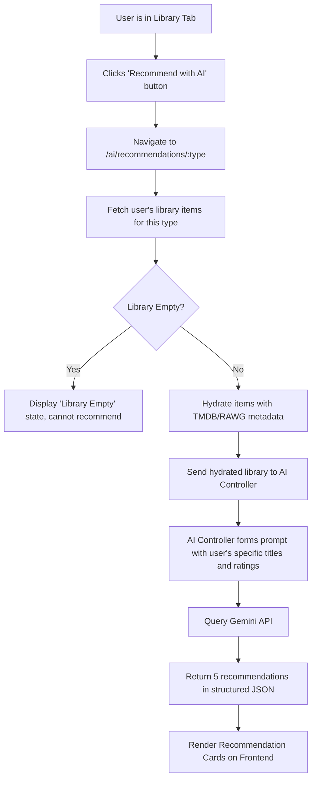

# AI Recommend Workflow

```mermaid
flowchart TD
    A[User is in Library Tab] --> B[Clicks 'Recommend with AI' button]
    B --> C[Navigate to /ai/recommendations/:type]
    C --> D[Fetch user's library items for this type]
    D --> E{Library Empty?}
    
    E -- Yes --> F[Display 'Library Empty' state, cannot recommend]
    E -- No --> G[Hydrate items with TMDB/RAWG metadata]
    
    G --> H[Send hydrated library to AI Controller]
    H --> I[AI Controller forms prompt with user's specific titles and ratings]
    I --> J[Query Gemini API]
    J --> K[Return 5 recommendations in structured JSON]
    K --> L[Render Recommendation Cards on Frontend]
```
