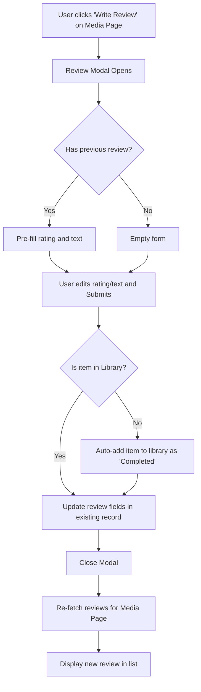

# Review & Rating Workflow

```mermaid
flowchart TD
    A[User clicks 'Write Review' on Media Page] --> B[Review Modal Opens]
    B --> C{Has previous review?}
    
    C -- Yes --> D[Pre-fill rating and text]
    C -- No --> E[Empty form]
    
    D --> F[User edits rating/text and Submits]
    E --> F
    
    F --> G{Is item in Library?}
    G -- No --> H[Auto-add item to library as 'Completed']
    G -- Yes --> I[Update review fields in existing record]
    H --> I
    
    I --> J[Close Modal]
    J --> K[Re-fetch reviews for Media Page]
    K --> L[Display new review in list]
```
