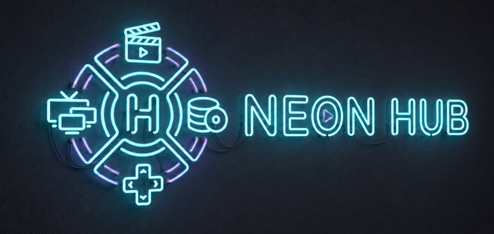

  
  <h1>Phase 6 Report: Dashboard</h1>
  
<strong>Neon Hub Development Report</strong>

  

## Overview
Phase 6 focused on building out the Dashboard views and endpoints to provide users with aggregated statistics, visual progress indicators, and an activity feed of their recent actions. This gives the application a premium "hub" feel as originally intended in the architecture.

## ✅ Deliverables Completed
- [x] **Backend Stats Endpoint**: Implemented `GET /api/dashboard/stats` via `dashboardController.js` and `dashboardModel.js` using efficient SQL queries to calculate total tracked media, completed media, total hours played, and the average rating across all media.
- [x] **Backend Activity Endpoint**: Implemented `GET /api/dashboard/activity`, pulling the 10 most recent actions from the `activity_log` table and hydrating them using the new `utils/hydrateItem.js` utility.
- [x] **Backend Genres Endpoint**: Implemented `GET /api/dashboard/genres`, evaluating the 50 most recently active media items to deduce the user's top 5 favorite genres (safely preventing rate limits from TMDB/RAWG).
- [x] **Frontend Components**: 
  - `StatsCard` for the KPI numbers.
  - `ProgressBar` built with native lightweight SVG elements.
  - `ActivityFeed` for rendering the recent actions timeline.
  - `GenreChart` built using `recharts` for an interactive bar chart of genre data.
- [x] **Frontend Integration**: Updated `Dashboard.jsx` to fetch and display this data dynamically via the `dashboardService.js`.

## 🧠 Technical Decisions
1. **Genre Analysis Rate-Limit Protection**: The original requirement asked for a breakdown of favorite genres. Because genre IDs and names are not stored in the database, fetching this requires a TMDB/RAWG API call per item. To prevent free-tier API throttling, the backend now only hydrates the 50 most recently tracked items. This is an accurate estimation of current tastes and keeps response times low.
2. **Recharts vs Custom SVG**: For the progress rings, a native SVG approach was used for zero overhead. For the bar chart, `recharts` was selected for a polished, interactive, professional UI.
3. **Hydration Utility**: Extracted `hydrateItem` from `libraryController.js` into `utils/hydrateItem.js` to ensure the Dashboard activity feed and the Library use the exact same hydration logic.

## ⚠️ Known Issues

> [!WARNING]
> / Next Steps
> - None. The Dashboard renders beautifully in dark mode with Neon accents. Ready for Phase 7 (Reviews & Lists).

